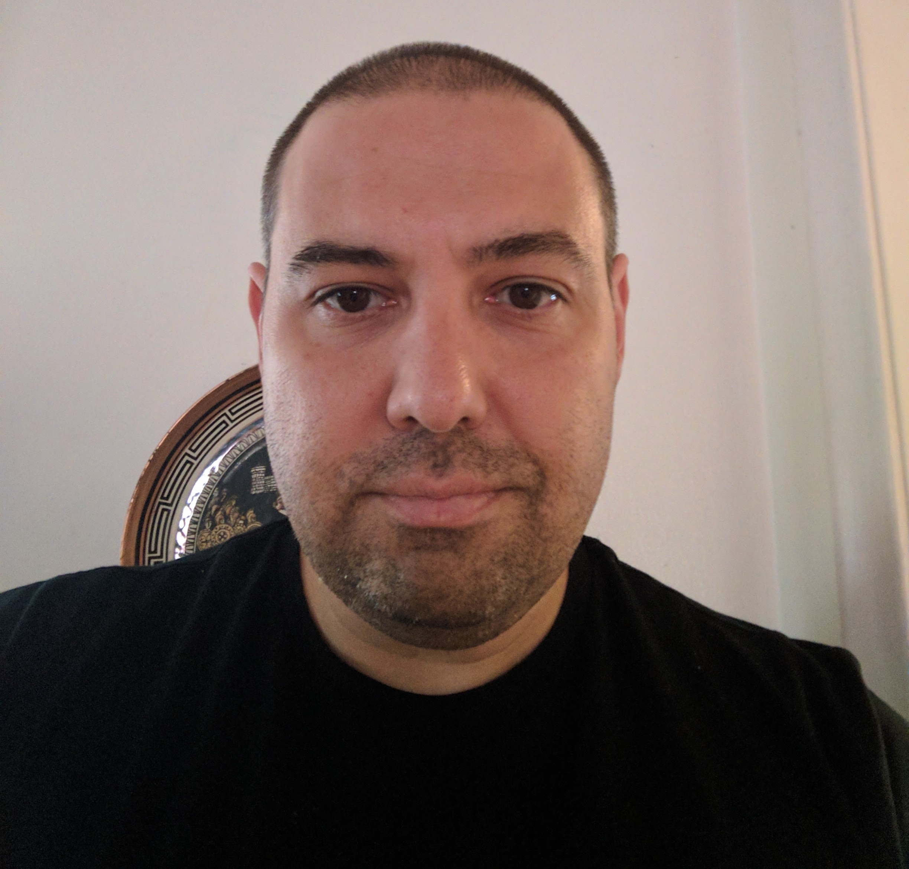

_You are now leaving Dystopia._

My name is Chris Dolunt (he/him). I live in Michigan. I’m a solarpunk anarchist and recovering cyberpunk focused on community support and climate action.

I work in library technology, building digital archives to support scholarly research.

I'm a former tabletop RPG freelancer. I wrote _Nyambe_ d20 for Atlas Games and _Rippers_ for Savage Worlds. I’ve also contributed monsters to _Deadlands_, _Feng Shui_, and _Penumbra_. My work has been nominated for (i.e. lost) the Diana Jones, Origins, and Ennie awards. I'm also a canon NPC (Kargas Dolunt, the first sorcerer) in _Dave Arneson's Blackmoor_, the D&D 3.5 version of the first ever RPG setting.

I'm a GenXer. I have high-functioning autism and fibromyalgia (currently controlled with medication).

I'm a husband and father. My adult children all have disabilities and have been through some serious health issues, including ITP, Lyme disease, and bone cancer. Healthcare is a human right.

All views and opinions are my own.